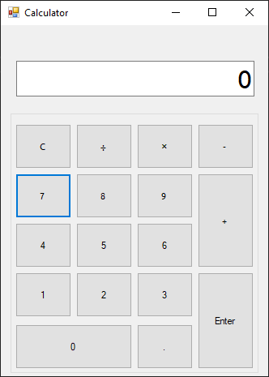
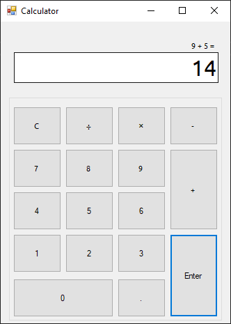
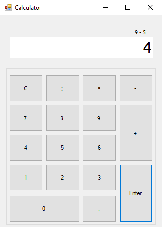
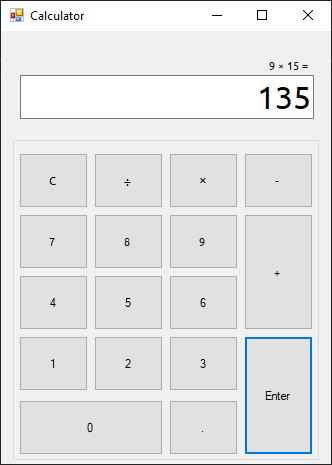
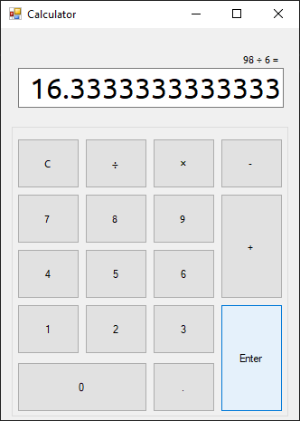
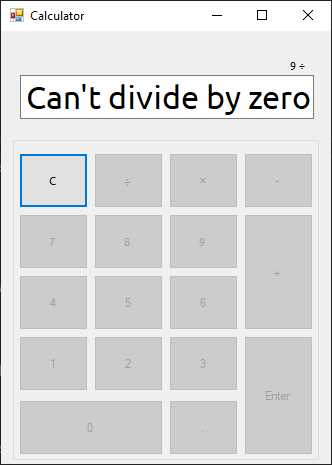

# Simple Calculator

---

A simple calculator created using C# .NET Windows Forms for CSELEC-13

---

## Screenshots

---

### First Run

### Operations

#### Addition

#### Subtraction

#### Multiplication

#### Division

### Errors

